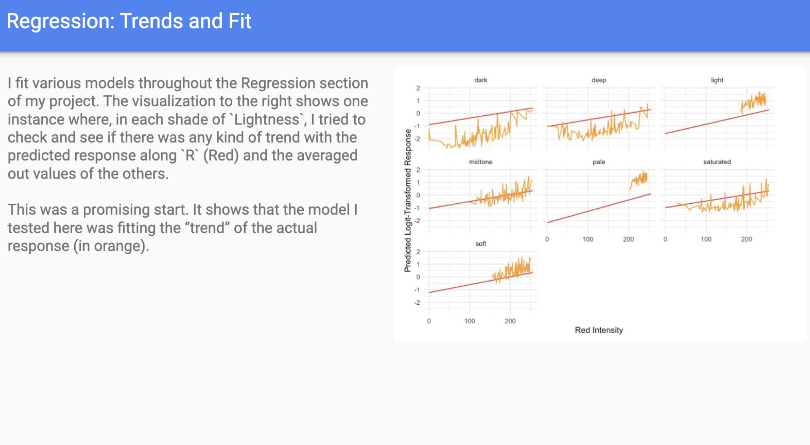

# ppg-paints-ml

This was a project sponsored by PPG Paints in an introductory course on Machine Learning that I did at the University of Pittsburgh.

The code used in this course was for a sponsorship and therefore I was unable to make it public: however, for the sake of my resume, I figured I would share the presentation that I gave on the results of my work.

This project was written in R and involved training a number of models on data provided by PPG that was left intentionally vague. We were given metrics by which we could compare the results of our models to determine if our models were effective, and all of my models scored very well against those metrics.

This project demonstrated a strong understanding of the underlying mathematical basis for writing custom models, training them, and using them to make actual predictions on real data. While I can't say for certain that my work was used by PPG in any meaningful way, I can say that this project exposed me to fundamental machine learning principles in a way that I wouldn't have learned just by using off-the-shelf models in python.
